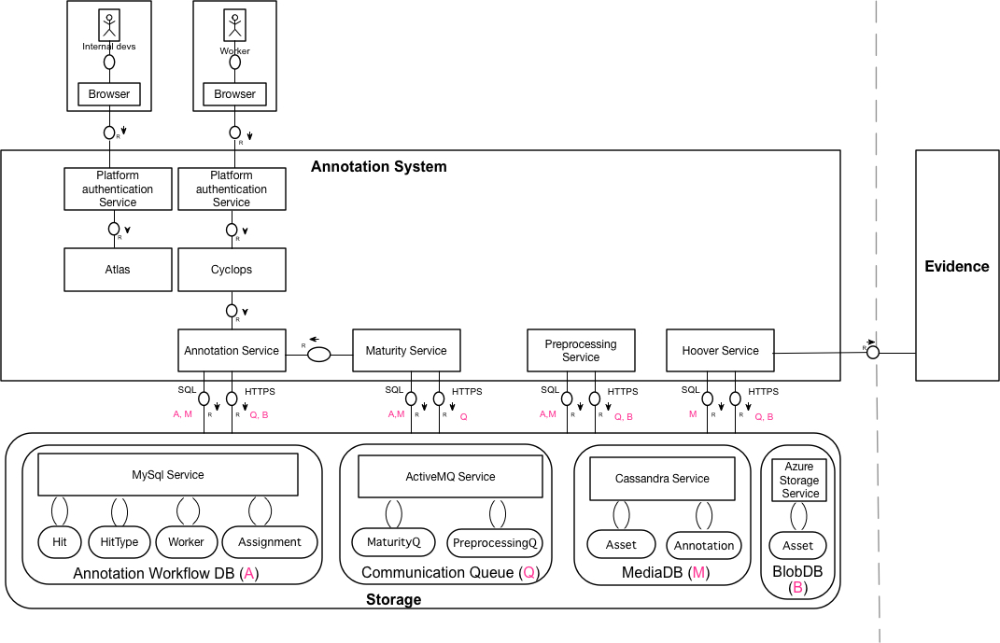
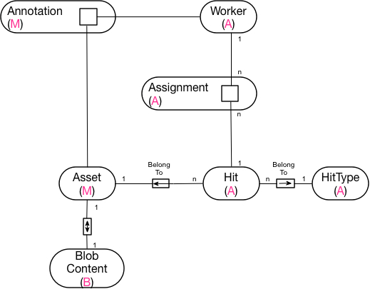

# AnnotationPlatform

# Table of Content
* System Conceptual Architect
* Systen Baheviors 
* System Entity Relationship Diagram (ERD)
* FMC Reference

# System Conceptual Architect
## System definition
Annotation system is an internal tool for worker to label certain activites and subjects captured in recorded video. The labeled data later will be consumsed by
* **Internal development team** for correctness validating and improvement seeking. 
* **Data scientist** to build model by getting insight from data that enriches orther products within the company with inllegent solution (compliant system, evidence system, intellegent activities recognition).

The system shell be able to extend to collect different required data source to support solution requirement of data scientists. 

Below is conceptual architect of the system.

## Conceptual design

The system consists of front end components and serveral busines logic services (or components) which are in reality implemented as micro-services in cloud deployment platform (Microsoft Asuze). Except the front end component, these services have it own functionality and storage.

In general, these services are independent and they communicates with each other mainly via a message queue (**communication queue**). Except the front end components, they communicate with backend business logic service via routed HTTPs REST call.

Below is high level description for each services. It is presented based on the flow of the data. First described component is where the data is collected ==> then data is preprocessed ==> stored ==> then annotation workflow assignment is generated ==> data is annotated by worker ==> finally, annotated data is validated by development team ==> then consumsed by data science researcher.

### Hoover
This is a data collector service which scans video / audio data from **Evidence.com** periodically. The schedule is configurable. 

The collected data is stored as binary (blob) format in **Microsoft Asure blob storage**. Each video is stored as an **asset** and download-able **blob content** file. Once the asset is stored, new preprocessing item is put in communication queue for preprocessing. 

### Preprocessing
This services preprocesses the collected data (currently from **Hoover**). The process gets triggerred by new arrived asset raised in communicate queue (ActiveMQ - **preprocessing queue**). 

The processing activites includes:
* Extract frame for annotating from video.
* Automatically roughtly classifying extracted frame into activity (**Hit**) of a correspondent type (**HitType**)
* Automatically reducing duplicated, similar video frame to minimize required annotating effort.
* For each recognized "activity" (**Hit**), required annotation **assignment** is generated.

### Annotation service
This is the backend service of annotation UI (**Cyclops**). It provides :
* Annotation **Assignment** loading and assigning to log-in **worker**.
* **Annotation** result storing and **maturity** checking firing.
* annotation **assignment** extending (adding more) in case the annotation for certains asset is not matured. The maturity of annotation of an asset is checking by **Maturity** service. This extending process is triggerred when it is requested by **Maturity** checking service via **"maturity queue"**.

### Maturity service
The service is mainly:
* checking the maturity (or completion) of annotation for an asset. The service is triggerred by **Annotation Service** via **"maturit queue"** whenever a new annotation result is stored. 
* storing "matured" **annotation** when maturity check returns "mature" based on annotation system's "maturity logic".
* triggering annotation assignment extending to annotation service via HTTP REST call whenever maturity checking returns "not-mature" for an asset.

### Cyclops
This is a front-ui of annotation platform. It's functionality is (but not restricted to):
* UI for worker to annotate the **asset**.
* Access point to annotation **assigment** for login worker and annotation storing service. 

All the authentication is using "cloud platform" built-in user adminstration and authentication service.

### Atlas
This is a internal application for validating the annotation result of the **worker**.

*Please checkout system behaviros digrams to understand how the system working*

# System behaviors
Below diagrams expresses system behavior (dynamic aspect of the system) over time and depicting the actions (functinalities) performed by the agents (services / components). 

## Data collecting 
*Coming soon*

## Data preprocessing 
*Coming soon*

## Data annotating
*Coming soon*

## Maturity checking
*Coming soon*

## Annotation auditing
*Coming soon*

# System Entity Relationship Diagram (ERD)
From above statical structures (conceptual architect) and dynamic structures (system behavior), we can realize the entities participating in the system. Below is the list of entites and thier relationship. 

# FMC reference
* [FMC home page](http://www.fmc-modeling.org)
